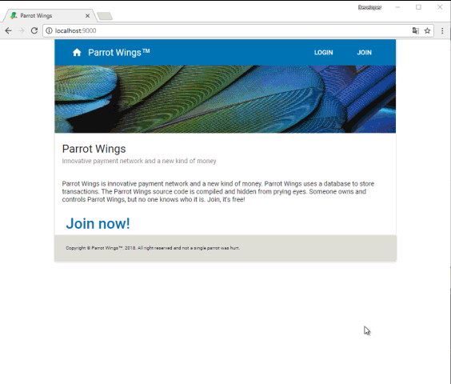

# –ü–æ—Å—Ç–∞–Ω–æ–≤–∫–∞ –∑–∞–¥–∞—á–∏:
The application is for Parrot Wings (PW, “internal money”) transfer between system users.
The application will be very “polite” and will inform a user of any problems (i.e. login not successful, not enough PW to remit the transaction, etc.)

### User registration 

Any person on Earth can register with the service for free, providing their Name (e.g. John Smith), valid email (e.g. jsmith@gmail.com) and password. 
When a new user registers, the System will verify, that the user has provided a unique (not previously registered in the system) email, and also provided human name and a password. These 3 fields are mandatory. Password is to be typed twice for justification. No email verification required.
On successful registration every User will be awarded with 500 (five hundred) PW starting balance.

### Logging in

Users login to the system using their email and password.
Users will be able to Log out.
No password recovery, change password, etc. functions required.

### PW

The system will allow users to perform the following operations:
1) See their Name and current PW balance always on screen
2) Create a new transaction. To make a new transaction (PW payment) a user will
a) Choose the recipient by querying the  User list by name (autocomplete). 
b) When a recipient chosen, entering the PW transaction amount. The system will check that the transaction amount is not greater than the current user balance.
c) Committing the transaction. Once transaction succeeded, the recipient account will be credited (PW++) by the entered amount of PW, and the payee account debited (PW--) for the same amount of PW. The system shall display PW balance changes immediately to the user.
3) (Optional) Create a new transaction as a copy from a list of their existing transactions: create a handy UI for a user to browse their recent transactions, and select a transaction as a basis for a new transaction. Once old transaction selected, all its details (recipient, PW amount) will be copied to the new transaction.
4) Review a list (history) of their transactions. A list of transactions will show the most recent transactions on top of the list and display the following info for each transaction:
a) Date/Time of the transaction
b) Correspondent Name
c) Transaction amount, (Debit/Credit  for PW transferred)
d) Resulting balance
(Optional) Implement filtering and/or sorting of transaction list by date, correspondent name and amount.

### Architecture requirements

1) WEB API application, server-side.
WEB API must implement RESTful service.
2) HTML front end application
3) Mobile application
HTML frontend and mobile application will implement full application functionality, and communicate with WEB API using JSON.

### Technical requirements

Use the following software:
1) Server side
a) MS SQL Server
b) IIS
c) Web API
d) Entity framework 
2) WEB HTML client
a) HTML5
b) Javascript or TypeScript
c) Angular or React
d) (optional) primeNG, material, bootstrap

# –îe–º–æ

Приложение предназначено для перевода Parrot Wings (PW, «внутренние деньги») между пользователями системы.

–ü—Ä–∏–ª–æ–∂–µ–Ω–∏–µ —Å–æ—Å—Ç–æ–∏—Ç –∏–∑ –¥–≤—É—Ö —á–∞—Å—Ç–µ–π:

1. Web API - ASP.NET
2. –ö–ª–∏–µ–Ω—Ç - react-application.

–ù–∞ —Å—Ç–æ—Ä–æ–Ω–µ —Å–µ—Ä–≤–µ—Ä–∞ —Ä–µ–∞–ª–∏–∑–æ–≤–∞–Ω –º–µ—Ö–∞–Ω–∏–∑–º –∞—É—Ç–µ–Ω—Ç–∏—Ñ–∏–∫–∞—Ü–∏–∏ –ø–æ–ª—å–∑–æ–≤–∞—Ç–µ–ª–µ–π, –ø–µ—Ä–µ–≤–æ–¥ –¥–µ–Ω–µ–≥ –º–µ–∂–¥—É –ø–æ–ª—å–∑–æ–≤–∞—Ç–µ–ª—è–º–∏ —Å–∏—Å—Ç–µ–º—ã –∏ –≤–µ–¥–µ–Ω–∏—è –∏—Å—Ç–æ—Ä–∏–∏ –ø–ª–∞—Ç–µ–∂–µ–π.

–ù–∞ —Å—Ç–æ—Ä–æ–Ω–µ –∫–ª–∏–µ–Ω—Ç–∞ —Ä–µ–∞–ª–∏–∑–æ–≤–∞–Ω –ø–æ–ª—å–∑–æ–≤–∞—Ç–µ–ª—å—Å–∫–∏–π –∏–Ω—Ç–µ—Ä—Ñ–µ–π—Å –¥–ª—è —Ä–µ–≥–∏—Å—Ç—Ä–∞—Ü–∏–∏ –ø–æ–ª—å–∑–æ–≤–∞—Ç–µ–ª–µ–π –∏ –∞—É—Ç–µ–Ω—Ç–∏—Ñ–∏–∫–∞—Ü–∏–∏, —Å—Ç—Ä–∞–Ω–∏—Ü–∞ –ø—Ä–æ—Ñ–∏–ª—è –ø–æ–ª—å–∑–æ–≤–∞—Ç–µ–ª—è –∏ —Ñ—É–Ω–∫—Ü–∏–æ–Ω–∞–ª –¥–ª—è –æ—Å—É—â–µ—Å—Ç–≤–ª–µ–Ω–∏—è –ø–µ—Ä–µ–≤–æ–¥–∞ –¥–µ–Ω–µ–≥ —É—á–∞—Å—Ç–Ω–∏–∫–∞–º —Å–∏—Å—Ç–µ–º—ã.

# –ò—Å–ø–æ–ª—å–∑—É–µ–º—ã–µ —Ç–µ—Ö–Ω–æ–ª–æ–≥–∏–∏ –∏ –±–∏–±–ª–∏–æ—Ç–µ–∫–∏
    

### –ò–Ω—Å—Ç—Ä—É–º–µ–Ω—Ç–∞—Ä–∏–π
* Visual Studion 2017
* Node.js v8.9.1

### Backend

* ASP.NET (.NET Framework v4.6), C#
* EntityFramework 6
* AspNet Identity
* Owin
* Newtonsoft.Json
* AutoMapper

### Database

* SQL Server LocalDB

### Frontend

* TypeScript v2.7
* webpack v4.1
* react v16.2
* react-router v4.2
* material-ui v0.20
* –∏ –º–Ω–æ–≥–æ–µ –¥—Ä—É–≥–æ–µ∞—Ä–∏–π
* Visual Studion 2017
* Node.js v8.9.1

### Backend

* ASP.NET (.NET Framework v4.6), C#
* EntityFramework 6
* AspNet Identity
* Owin
* Newtonsoft.Json
* AutoMapper

### Database

* SQL Server LocalDB

### Frontend

* TypeScript v2.7
* webpack v4.1
* react v16.2
* react-router v4.2
* material-ui v0.20
* –∏ –º–Ω–æ–≥–æ–µ –¥—Ä—É–≥–æ–µ